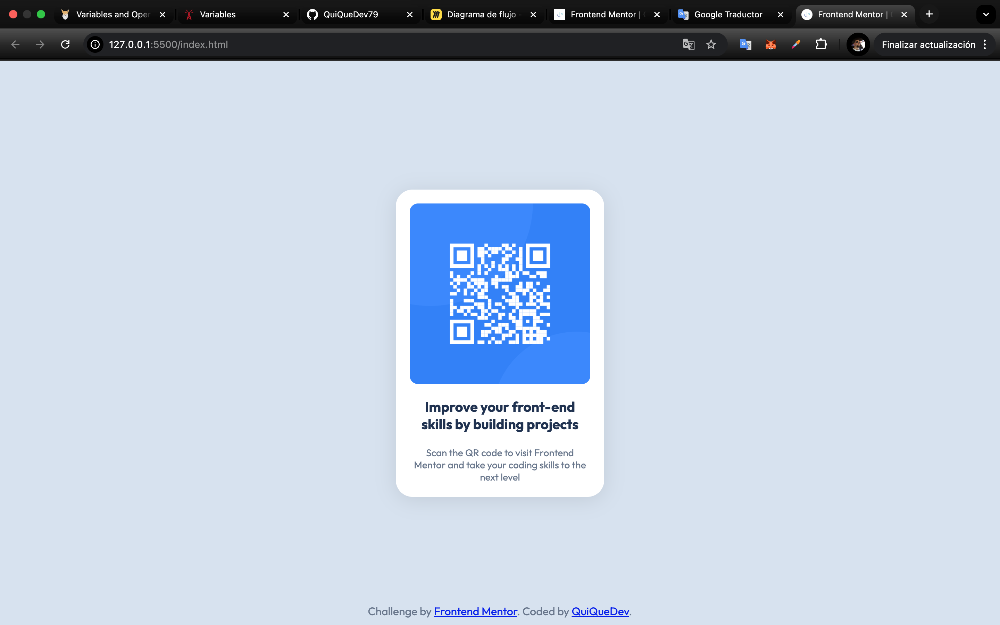

# Frontend Mentor - QR code component solution

This is a solution to the [QR code component challenge on Frontend Mentor](https://www.frontendmentor.io/challenges/qr-code-component-iux_sIO_H). Frontend Mentor challenges help you improve your coding skills by building realistic projects. 

## Table of contents

- [Frontend Mentor - QR code component solution](#frontend-mentor---qr-code-component-solution)
  - [Table of contents](#table-of-contents)
    - [Overview](#overview)
    - [Screenshot](#screenshot)
    - [Links](#links)
  - [My process](#my-process)
    - [Built with](#built-with)
    - [What I learned](#what-i-learned)
    - [Continued development](#continued-development)
    - [Useful resources](#useful-resources)
    - [Recursos útiles](#recursos-útiles)
  - [Author](#author)

### Overview

This is my first Frontend Mentor challenge, which involves a QR code component.
I edited the HTML and CSS code from scratch.
I hope to continue advancing in my learning.

### Screenshot




### Links
***Me falta esto***
- Solution URL: [Add solution URL here](https://your-solution-url.com)
- Live Site URL: [Add live site URL here](https://your-live-site-url.com)

## My process

### Built with

- Semantic HTML5 markup
- CSS custom properties
- Flexbox


### What I learned

I learned how to import external sources.

```css
@import url(https://fonts.googleapis.com/css2?family=Outfit:wght@400;700&display=swap);
```


### Continued development

I need to continue learning HTML and CSS so I can start with Javascript.

### Useful resources

- [mdn](https://developer.mozilla.org/en-US/) - This site has been a great help to me in everything, especially during this learning phase. This time I had questions about Flexbox.
- [Irina Delgado](https://www.youtube.com/@irimaya) - I still don't understand everything in English, so I'm looking for resources in my language. Here I learned how to add fonts from Google.
- [Google Traslate](https://translate.google.com/?hl=es-419&tab=TT&sl=auto&tl=en&op=translate) - I definitely can't live without this. I'm learning English, but this makes it faster.

### Recursos útiles

- [Recurso de ejemplo 1](https://www.example.com) - Esto me ayudó por XYZ. Me gustó mucho este patrón y lo usaré en el futuro.
- [Recurso de ejemplo 2](https://www.example.com) - Este es un artículo increíble que me ayudó a comprender XYZ. Se lo recomiendo a cualquiera que aún esté aprendiendo este concepto.

## Author

- Github - [QuiQueDev79](https://github.com/QuiQueDev79)
- Frontend Mentor - [@QuiQueDev79](https://www.frontendmentor.io/profile/QuiQueDev79)

